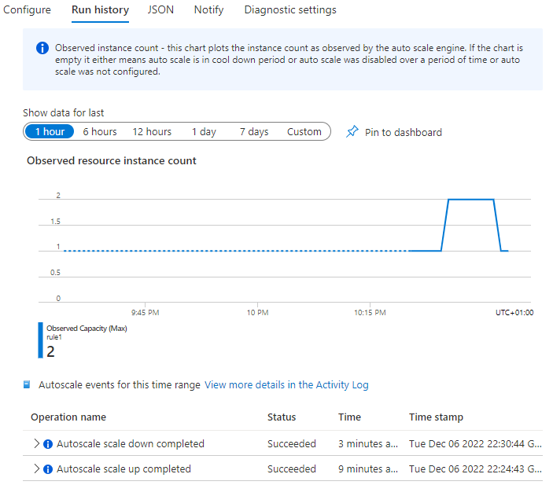

# Purpose

This repository contains a Bicep template to setup an App Service Linux and a Service Bus Namespace (+ a queue, named `jobs`). 

App Service is deployed with dummy logic to consume messages from the queue.

App Service Plan will scale-out/in depending on the number of messages in the queue. 

# Deploy the infrastructure

```powershell
az login
$subscription = "Training Subscription"
az account set --subscription $subscription

$rgName = "frbar-appservice-queue-scaling"
$envName = "fbqs1"
$location = "France Central"

az group create --name $rgName --location $location
az deployment group create --resource-group $rgName --template-file infra.bicep --mode complete --parameters envName=$envName
```

# Build and Deploy

```powershell
dotnet publish .\src\Frbar.AzurePoc.BackendApi\ -r linux-x64 --self-contained -o publish
Compress-Archive publish\* publish.zip -Force
az webapp deployment source config-zip --src .\publish.zip -n "$($envName)-app" -g $rgName
```

# Test

Using the `Service Bus Explorer` (Azure Portal), send 30 messages into the `jobs` queue. They will be dequeued at a rate of 20 per minute (1 every 5 sec). Scaling rule wil kick in quickly and scale-out to 2 instances. Scale-in will then happen in 5/6 minutes. 



# Tear down

```powershell
az group delete --name $rgName
```

# Cookbook

```powershell
az group export --name $rgName > main.json
az bicep decompile --file main.json
```

